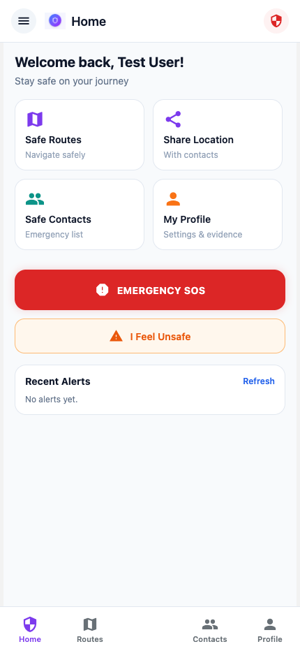
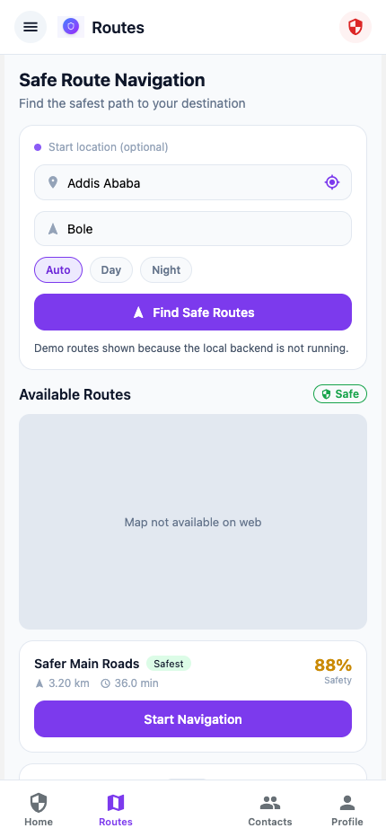
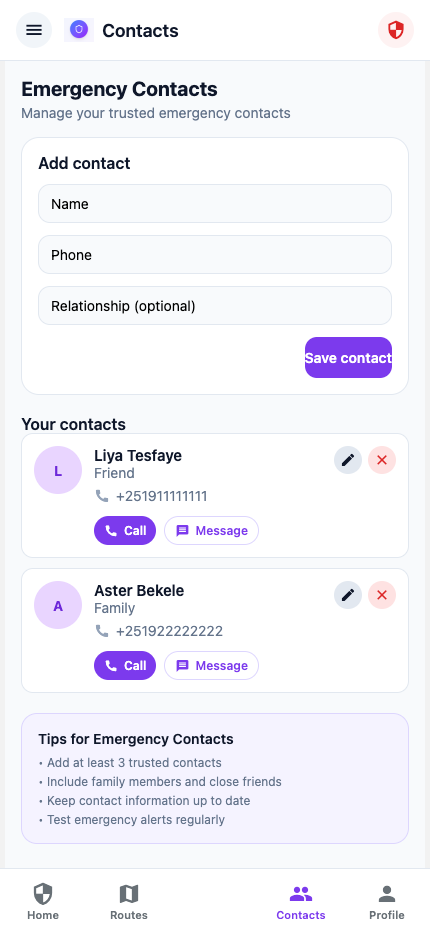
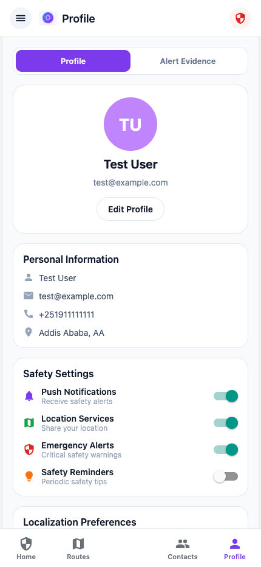

# SafeRoute 🛡️

SafeRoute is a mobile safety and navigation application designed to help people move more confidently through Addis Ababa. The app combines safe route planning, trusted contact management, live location sharing, SOS alerts, and emergency evidence collection in one place.

The goal of SafeRoute is to support personal safety for local residents, students, women, tourists, and other travelers by prioritizing safer journeys, not only the fastest routes.

## 📱 App Screenshots

| Home | Routes |
| --- | --- |
|  |  |

| Contacts | Profile |
| --- | --- |
|  |  |

## ✨ Core Features

- 🧭 **Safe Route Navigation**: Suggests routes using safety-focused criteria instead of only time and distance.
- 📍 **Live Location Sharing**: Allows users to share real-time location with trusted contacts.
- 🚨 **Emergency SOS Alert**: Sends an emergency alert and shares the user location with selected contacts.
- ⏱️ **Medium Alert Timer**: Starts a safety check-in timer that can escalate to SOS if the user does not confirm safety.
- 👥 **Emergency Contacts**: Lets users add, update, and manage trusted contacts.
- 🎙️ **Emergency Evidence**: Supports collecting emergency evidence such as location, audio, and photos during SOS events.
- ⭐ **Route Feedback**: Allows users to rate routes and contribute to community safety information.
- 👤 **Profile Management**: Users can manage personal information and safety preferences.

## 🎯 Project Objective

SafeRoute was created to address the lack of an integrated safety and navigation platform for Addis Ababa. Existing navigation tools usually optimize for speed and distance, while many safety tools only provide separate emergency buttons or location sharing. SafeRoute brings these needs together in one mobile application.

## 🧩 Project Scope

SafeRoute focuses on:

- Safe route planning
- Live location sharing
- One-tap SOS alerts
- Emergency contact management
- Emergency evidence collection
- Route safety feedback

The current scope does not include direct integration with live police dispatch, always-listening SOS activation, nationwide coverage, or real-time crime data integration.

## 🛠️ Tech Stack

### Frontend

- Expo
- React Native
- Expo Router
- React Native Web

### Backend

- Node.js
- Express.js
- PostgreSQL / Supabase
- JWT authentication
- SMSEthiopia for SMS notifications
- Mapbox or OpenStreetMap routing services

## 📂 Project Structure

```text
SafeRoute/
├── backend/          # Express API, authentication, routing, alerts, contacts
├── frontend/         # Expo React Native app
├── docs/             # Project docs and README screenshots
└── figma-src/        # UI source/design implementation files
```

## 🚀 Getting Started

### 1. Install frontend dependencies

```bash
cd frontend
npm install
```

### 2. Run the app on web

```bash
npm run web
```

### 3. Install backend dependencies

```bash
cd backend
npm install
```

### 4. Configure backend environment

Create `backend/.env` using `backend/.env.example`:

```env
PORT=4000
SUPABASE_URL=your-supabase-url
SUPABASE_SERVICE_ROLE_KEY=your-supabase-service-role-key
JWT_SECRET=your-jwt-secret
MAPBOX_TOKEN=your-mapbox-token
SMSETHIOPIA_API_KEY=your-smsethiopia-api-key
SMSETHIOPIA_API_URL=https://smsethiopia.com/api/sms/send
SUPABASE_EVIDENCE_BUCKET=emergency-evidence
```

### 5. Run the backend

```bash
cd backend
npm start
```

## 🧪 Testing Account

For local web testing, use:

```text
Email: test@example.com
Password: test123
Phone: +251911111111
Demo OTP: 123456
```

## 🔐 Security Notes

- Passwords are hashed before storage.
- Authenticated requests use JWT tokens.
- Emergency evidence is intended to be stored securely with controlled access.
- Users manage their own trusted contacts and profile information.

## 🌍 Impact

SafeRoute supports safer movement in Addis Ababa by helping users choose safer paths, share their location with trusted people, and quickly trigger emergency support when needed.
